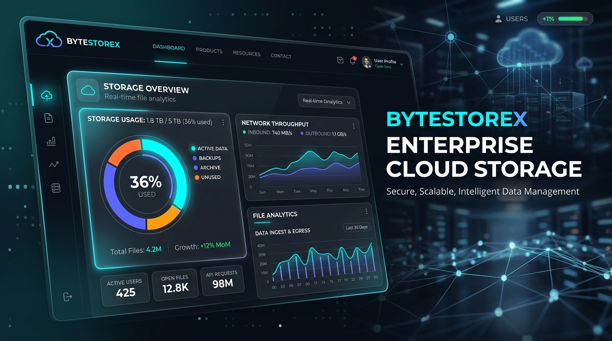
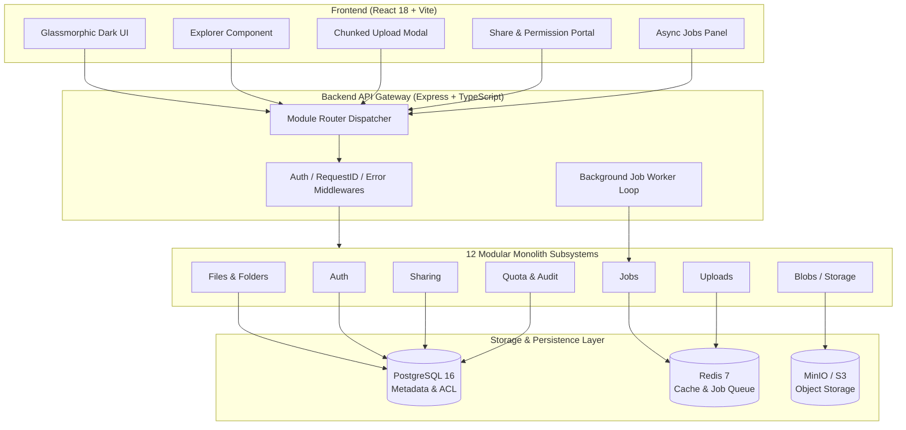

<div align="center">

# ⚡ ByteStoreX

### *Enterprise-Grade Cloud Storage & Modular File Management Platform*

[](https://nodejs.org/)
[](https://www.typescriptlang.org/)
[](https://react.dev/)
[](https://expressjs.com/)
[](https://www.postgresql.org/)
[](https://redis.io/)
[](https://min.io/)
[](https://www.docker.com/)
[](LICENSE)

<br />



</div>

---

## 📌 Executive Summary

**ByteStoreX** is a modern, high-performance, modular monolith cloud storage system built to handle high-throughput file management, secure content distribution, object storage streaming, and async background processing. 

Featuring a sleek dark-mode React client and a highly structured Express TypeScript backend, ByteStoreX combines **Amazon S3 / MinIO object storage compatibility**, **chunked multipart file ingestion**, **granular file versioning**, **time-bound share portals**, and **real-time storage quota enforcement**.

---

## ✨ Key Features

### 📁 Advanced File & Directory Operations
- **Hierarchical Storage**: Multi-level folder navigation with path traversal guards.
- **Version Control & History**: Keep track of file mutations with rollback and revision inspection.
- **Inline Previews & Contextual Actions**: Interactive context menus for downloading, moving, renaming, sharing, and inspecting file metadata.
- **Soft Delete & Trash Recovery**: Two-phase deletion lifecycle with soft-delete staging and permanent purge safety mechanisms.

### ⚡ Resilient Upload & Blob Storage Engine
- **Chunked Multipart Uploads**: Reliable file ingestion broken into resilient stream chunks to prevent upload drops on large payloads.
- **S3 / MinIO & Local Provider Abstraction**: Seamless content-addressable storage driver switching between MinIO S3 object buckets and local file systems.
- **Blob Deduplication & Integrity**: Cryptographic checksum hashing ensures efficient storage space utilization.

### 🔗 Secure Sharing & Fine-Grained Access Control (ACL)
- **Protected Share Links**: Generate shareable URLs with optional password protection and expiration timers.
- **Permission Scoping**: Configure read-only, download, or edit capabilities per share payload.
- **Access Telemetry**: Track total view counts, download statistics, and access timestamps per shared asset.

### 📊 Storage Quotas & Visual Usage Analytics
- **Dynamic Quota Enforcement**: Real-time user quota monitoring prevents system over-subscription.
- **MIME Breakdown Engine**: Visual metrics detailing consumption by Images, Videos, Documents, Archives, and Code files.

### ⚙️ Asynchronous Job Processing Queue
- **Background Worker Dispatcher**: In-process background job loop (polling queue) handling long-running file assembly, virus checks, thumbnail generation, and cleanup operations.
- **Real-Time Job Monitoring Panel**: Live UI view to inspect job status, progress, retries, and errors.

### 🛡️ Observability & Enterprise Security
- **Request ID Tracking**: End-to-end `AsyncLocalStorage` request correlation IDs across all logs.
- **Enriched `/health` Endpoint**: Live operational telemetry detailing RSS memory, heap allocations, and active system entity counters.
- **Audit Logging**: Comprehensive activity audit log feed tracking file access, auth actions, and configuration changes.

---

## 🏗️ System Architecture

ByteStoreX utilizes a **Modular Monolith** architecture designed for clean separation of concerns, rapid execution, and straightforward scalability.



---

## 🧩 Backend Modular Subsystems

The backend server (`server/src/modules/`) is cleanly partitioned into 12 domain-specific modules:

| Subsystem | Responsibilities & API Scope |
| :--- | :--- |
| 🔑 **Auth** (`/api/v1/auth`) | User registration, login, JWT token issuance, and password hashing (`bcryptjs`). |
| 👤 **Users** (`/api/v1/users`) | User profile administration, setting management, and account preferences. |
| 📄 **Files** (`/api/v1/files`) | File CRUD, metadata retrieval, version management, and moving/renaming. |
| 📂 **Folders** (`/api/v1/folders`) | Tree creation, subfolder navigation, parent resolution, and path calculation. |
| ⬆️ **Uploads** (`/api/v1/uploads`) | Multipart session initialization, chunk ingestion, and assembly completion. |
| 🪣 **Blobs** (`/api/v1/blobs`) | Raw blob binary streaming, range request serving, and storage driver access. |
| 💾 **Storage** (`/api/v1/storage`) | Object storage engine interactions (MinIO S3 / Local FS). |
| 🔗 **Sharing** (`/api/v1/sharing`) | Share link generation, token validation, password verification, and access count limits. |
| 🔍 **Search** (`/api/v1/search`) | Indexing, filename pattern matching, MIME type filtering, and search queries. |
| 🗑️ **Trash** (`/api/v1/trash`) | Soft-deleted file staging, restoration handlers, and permanent purge execution. |
| ⚙️ **Jobs** (`/api/v1/jobs`) | Background task status monitoring, queue dispatching, and worker control. |
| 📊 **Quota & Audit** (`/api/v1/quota`, `/api/v1/audit`) | Quota usage calculations, storage limit checks, and structured security audit feeds. |

---

## 🛠️ Technology Stack

### Frontend Client
* **Framework**: [React 18](https://react.dev/) + [Vite](https://vitejs.dev/)
* **Language**: [TypeScript](https://www.typescriptlang.org/)
* **Icons & Styling**: [Lucide React Icons](https://lucide.dev/), Custom Glassmorphic Dark Design System
* **State & Networking**: React Context API, Fetch API with error handling

### Backend Server
* **Runtime**: [Node.js](https://nodejs.org/) v20+
* **Framework**: [Express.js](https://expressjs.com/)
* **Language**: [TypeScript](https://www.typescriptlang.org/) (`tsx` / `tsc`)
* **Authentication**: JSON Web Tokens (JWT) & `bcryptjs`
* **Validation**: [Zod](https://zod.dev/) schema validation

### Database & Storage Infrastructure
* **Relational DB**: [PostgreSQL 16](https://www.postgresql.org/) (User accounts, file/folder trees, permissions, share links)
* **Caching & Queue**: [Redis 7](https://redis.io/) (Session management, job queues, fast rate limiting)
* **Object Storage**: [MinIO S3 Object Storage](https://min.io/) (Compatible with AWS S3 API)
* **Containerization**: [Docker Compose](https://docs.docker.com/compose/)

---

## ⚡ Quick Start Guide

### Prerequisites
Make sure you have the following installed on your system:
* [Node.js v20+](https://nodejs.org/)
* [npm v10+](https://www.npmjs.com/)
* [Docker & Docker Compose](https://www.docker.com/)

---

### Step 1: Clone Repository

```bash
git clone https://github.com/your-username/ByteStoreX.git
cd ByteStoreX
```

---

### Step 2: Spin Up Infrastructure Services (Docker)

Launch PostgreSQL, Redis, MinIO, and MinIO Bucket Auto-Initializer with Docker Compose:

```bash
docker-compose up -d
```

> **Verified Services Running:**
> * 🐘 **PostgreSQL**: `localhost:5432` (DB: `bytestorex_db`)
> * 🔴 **Redis**: `localhost:6379`
> * 🪣 **MinIO API**: `localhost:9000`
> * 🎛️ **MinIO Console**: `http://localhost:9001` (User: `minio_admin`, Password: `minio_password_2026`)

---

### Step 3: Server Setup & Startup

1. Navigate to the `server` directory:
   ```bash
   cd server
   ```
2. Install dependencies:
   ```bash
   npm install
   ```
3. Configure environment variables (a preconfigured `.env` is available, or copy from `.env.example`):
   ```bash
   cp .env.example .env
   ```
4. Run database migrations:
   ```bash
   npm run migrate
   ```
5. Start the backend development server:
   ```bash
   npm run dev
   ```
   *The server will start on `http://localhost:5000` with background worker polling enabled.*

---

### Step 4: Client Setup & Startup

1. Open a new terminal tab and navigate to the `client` directory:
   ```bash
   cd client
   ```
2. Install dependencies:
   ```bash
   npm install
   ```
3. Start the Vite React development server:
   ```bash
   npm run dev
   ```
4. Open your browser and navigate to `http://localhost:5173`.

---

## ⚙️ Environment Configuration

Below are the primary environment variables configured in `server/.env.example`:

```env
# Application Server
NODE_ENV=development
PORT=5000
JWT_SECRET=bytestorex-super-secret-key-change-in-production-2026
JWT_EXPIRES_IN=24h

# PostgreSQL Database
POSTGRES_HOST=localhost
POSTGRES_PORT=5432
POSTGRES_DB=bytestorex_db
POSTGRES_USER=postgres
POSTGRES_PASSWORD=12345

# Redis Cache & Queue
REDIS_HOST=localhost
REDIS_PORT=6379

# MinIO S3 Object Storage
MINIO_ENDPOINT=localhost
MINIO_PORT=9000
MINIO_USE_SSL=false
MINIO_ACCESS_KEY=minio_admin
MINIO_SECRET_KEY=minio_password_2026
MINIO_BUCKET_NAME=bytestorex-bucket

# Storage Limits
DEFAULT_QUOTA_BYTES=10737418240  # 10 GB
MAX_FILE_SIZE_BYTES=5368709120   # 5 GB
```

---

## 📡 API Overview & Endpoints

| Method | Endpoint | Description | Auth Required |
| :--- | :--- | :--- | :---: |
| `GET` | `/health` | System health check, memory & active entity count | ❌ |
| `POST` | `/api/v1/auth/register` | Register a new user account | ❌ |
| `POST` | `/api/v1/auth/login` | Authenticate user & receive JWT | ❌ |
| `GET` | `/api/v1/files` | List files with filtering & pagination | Bearer JWT |
| `POST` | `/api/v1/files` | Create file metadata record | Bearer JWT |
| `GET` | `/api/v1/folders` | Retrieve folder tree structure | Bearer JWT |
| `POST` | `/api/v1/uploads/init` | Initialize chunked upload session | Bearer JWT |
| `POST` | `/api/v1/uploads/chunk` | Upload individual file chunk | Bearer JWT |
| `POST` | `/api/v1/uploads/complete` | Finalize & assemble chunked upload | Bearer JWT |
| `POST` | `/api/v1/sharing` | Create share link (password, expiration) | Bearer JWT |
| `GET` | `/api/v1/sharing/:token` | Access & download shared file via token | Optional / Password |
| `GET` | `/api/v1/quota` | Get user quota consumption & MIME breakdown | Bearer JWT |
| `GET` | `/api/v1/trash` | List soft-deleted items | Bearer JWT |
| `POST` | `/api/v1/trash/restore` | Restore file/folder from trash | Bearer JWT |
| `GET` | `/api/v1/jobs` | Monitor status of background worker queue | Bearer JWT |

---

## 📂 Repository Layout

```
ByteStoreX/
├── docker-compose.yml       # Infrastructure orchestration (Postgres, Redis, MinIO)
├── docs/
│   └── images/              # Visual assets & hero banners
│       └── hero_banner.jpg
├── client/                  # React 18 + Vite + TypeScript Frontend
│   ├── src/
│   │   ├── api/             # API client services & fetch wrappers
│   │   ├── components/      # UI components (Explorer, ShareModal, JobsMonitor, etc.)
│   │   ├── context/         # Auth & App state contexts
│   │   ├── App.tsx          # Main React Application container
│   │   └── index.css        # Premium Glassmorphic Dark UI styles
│   ├── package.json
│   └── vite.config.ts
└── server/                  # Express + TypeScript Modular Monolith Backend
    ├── src/
    │   ├── core/            # Logging, Request ID context, Error middlewares
    │   ├── migrations/      # DB Migration scripts & schema definition
    │   ├── modules/         # 12 Domain modules (Auth, Files, Sharing, Blobs, etc.)
    │   ├── shared/          # In-memory DB / ORM abstraction & helpers
    │   ├── app.ts           # Express App initialization & router binding
    │   └── server.ts        # Server listener entrypoint
    ├── .env.example
    └── package.json
```

---

## 📄 License

Distributed under the **MIT License**. See `LICENSE` for more information.

<br />

<div align="center">
Made with ❤️ for high-performance cloud storage engineering.
</div>
